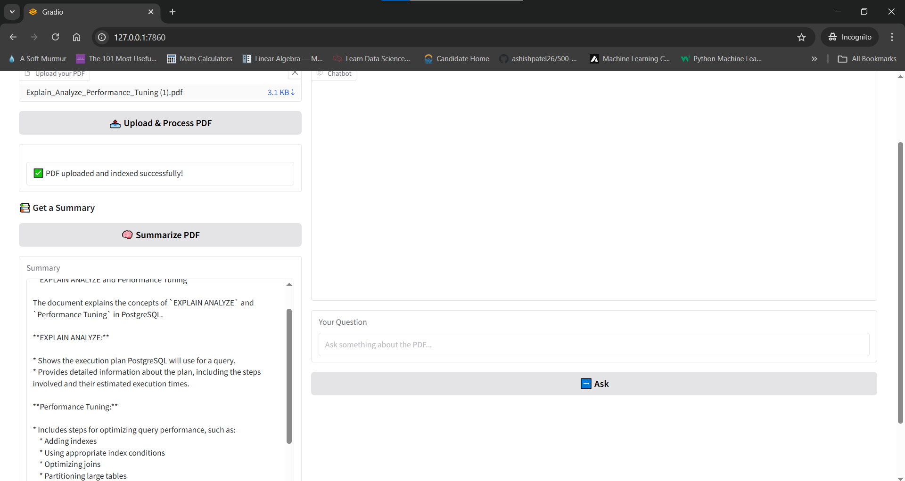
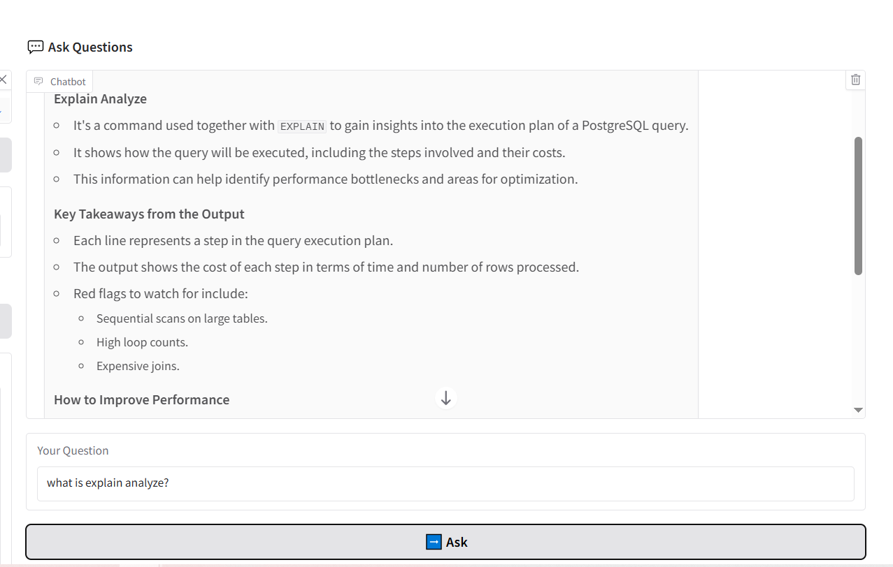

# 📄 AI-Powered PDF Chat Assistant

A lightweight, privacy-friendly assistant that lets you:
- 🧠 Summarize PDFs
- 💬 Ask questions about the content
- 💾 Run entirely offline using local LLMs via Ollama

---

## 🚀 Features

✅ Upload and parse any PDF using PyMuPDF
✅ Chunk and embed content using Sentence Transformers
✅ Store embeddings in ChromaDB for fast vector search
✅ Summarize PDF content using a local LLM (`gemma:2b` or `llama3`)
✅ Ask questions and get accurate answers from the PDF
✅ Auto-select faster models for short vs. long PDFs
✅ Clean Gradio UI for upload, summary, and Q&A interaction
✅ 100% local — no API keys or internet access required

---

## 🧠 How It Works

1. Extracts text from uploaded PDF
2. Splits text into smaller chunks (~300 words with overlap)
3. Embeds chunks with `all-MiniLM-L6-v2`
4. Stores embeddings in ChromaDB
5. On user query or summary request:
   - Retrieves top-matching chunks (for Q&A)
   - Uses prompt + chunks to generate answer/summary via Ollama

---

## 🛠 Tech Stack

| Tool            | Purpose                        |
|-----------------|--------------------------------|
| Python          | Core backend logic             |
| Gradio          | Web UI                         |
| PyMuPDF         | PDF text extraction            |
| SentenceTransformers | Chunk embedding            |
| ChromaDB        | Vector database                |
| Ollama          | Local LLM runtime (`gemma`, `llama3`) |

---

## 🧪 Local Setup

### 1. Clone the repo

```bash
git clone https://github.com/your-username/pdf-search-assistant.git
cd pdf-search-assistant
```

### 2. Install dependencies

```bash
pip install -r requirements.txt
```

### 3. Pull required models using Ollama

```bash
ollama pull gemma:2b
ollama pull llama3
```

### 4. Run the app

```bash
python ui/app.py
```

Access it at `http://localhost:7860`

---

## 📂 Folder Structure

```
pdf-search-assistant/
├── ui/
│   └── app.py              # Gradio UI logic
├── src/
│   ├── pdf_reader.py       # Extracts text from PDFs
│   └── qa_pipeline.py      # Embeds, stores, and queries
├── data/                   # Uploaded PDFs (optional)
├── requirements.txt
└── README.md
```

---

## 🎯 Example Use Cases

- Summarizing academic papers or resumes
- Asking questions about contracts or proposals
- Reviewing meeting transcripts or case files

---
---

## 🖼️ Demo Screenshots

### 📤 Upload and Process PDF


### 📚 Summarize the PDF


### 💬 Ask Questions from the PDF


---
## 📌 What’s Next? (If You Want to Extend)

- [ ] Streamed responses from LLMs
- [ ] Source references in answers
- [ ] Multi-PDF upload support
- [ ] Export summaries

---

## 👤 Author

Built with ❤️ by Vyshnavi Kunapareddy


---

## 🪪 License

MIT License
